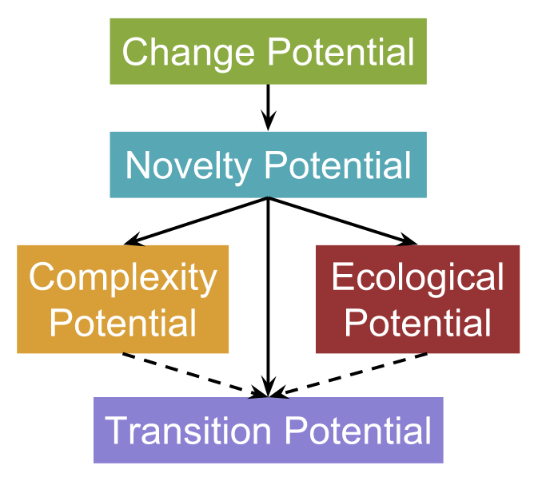

## Open-Ended Evolution is a huge concept

- To make scientific progress, we need a way to approach it incrementally
- Metrics of relative open-endedness allow this
- Evolutionary activity statistics
- Complexity barriers

## Our approach

- Last year we presented a suite of four metrics:
    - Change
    - Novelty
    - Ecology
    - Complexity
- Here, we test these metrics in a simple, well-studied system: NK landscapes


## NK Landscapes

- Popular model for studying evolutionary dynamics in bitstrings
- N = length of bitstring
- K = Interaction among bits

<span align="center"> 1 0 1 1 1 0 0</span>

# Filtering out noise

## Filtering out noise
- Evolution is an inherently noisy process
    - Not all parts of a genome contribute to its success
    - Many members of a population are the result of deleterious mutations

## Filtering the genome

- Determine the fitness effect of changing each site in genome
- Build a "skeleton"" of informative sites

Example goes here

## Filtering the population

- Previous approaches:  
    - Evolutionary activity statistics shadow run 
    - Fossil record 
    
- We build on Bedau et. al.'s approach to the fossil record

## Filtering the population


# Metrics

## Change

How much does the population composition change during an interval?


## Novelty

How many entirely new strategies arise during an interval?


## Ecology

How much does "meaningful” diversity to increase during an interval?


## Complexity

How much does the greatest individual complexity increase during an interval?


## Transitions

Does the population undergo changes in what it means to be an individual?


## Fitting them together



# A simple example {#simple_example}


# Results

```{r, fig.show=FALSE,message=TRUE,results='hide', echo=FALSE, cache=TRUE}
library(ggplot2)
oee_data <- read.csv("~/repos/Empirical/examples/evo/oee_data.csv")
setwd("~/repos/oee/figs")

#Order treatments correctly
oee_data$treatment <- factor(oee_data$treatment, levels = c("K_3_N_20_POP_200_MUT_3_standard", "K_10_N_20_POP_200_MUT_3_standard","K_3_N_100_POP_200_MUT_3_standard","K_3_N_20_POP_200_MUT_1_standard","K_3_N_20_POP_200_MUT_6_standard","K_3_N_20_POP_20_MUT_3_standard","K_3_N_20_POP_1000_MUT_3_standard","K_3_N_20_POP_200_MUT_3_changing_environment","K_3_N_20_POP_200_MUT_3_fitness_sharing","K_3_N_20_POP_200_MUT_3_standard_5000_updates","K_3_N_20_POP_200_MUT_1_standard_5000_updates","K_3_N_20_POP_200_MUT_3_changing_environment_5000_updates","K_0_N_20_POP_200_MUT_3_changing_environment_5000_updates","K_3_N_20_POP_20_MUT_3_standard_5000_updates","K_3_N_20_POP_200_MUT_6_standard_5000_updates","K_3_N_20_POP_1000_MUT_3_standard_5000_updates","K_3_N_20_POP_5000_MUT_3_standard_5000_updates","K_3_N_20_POP_200_MUT_3_fitness_sharing_5000_updates"))
oee_data$POP_SIZE <- as.factor(oee_data$POP_SIZE)
oee_data$MUT <- as.factor(oee_data$MUT)
treatment_labels <- c("Baseline", "High K (10)", "High N (100)", "Low mutation\n(1)", "High mutation\n(6)", "Small pop\n(20)", "Large pop\n(1000)", "Changing\nenvironment", "Fitness\nsharing")

```

## Change

```{r, echo=FALSE, message=FALSE, fig.height=5, fig.width=12, cache=TRUE}
ggplot(data=subset(oee_data, oee_data$change > -1 & (oee_data$treatment == "K_3_N_20_POP_200_MUT_3_standard_5000_updates")), aes(group=treatment, x=uid)) + stat_summary(fun.data = mean_cl_boot, aes(y=change,color=treatment, fill=treatment), geom="smooth") + theme_classic() + theme(axis.line.x=element_line("black"), axis.line.y=element_line("black"), axis.title=element_text(size = 18), legend.text=element_text(size=14), axis.text=element_text(size=14), legend.position="bottom")+ scale_y_continuous("Change metric") + scale_x_continuous("Update")  + scale_color_discrete("Treatment ", labels=c("Baseline", "Changing environment", "Fitness sharing")) + scale_fill_discrete("Treatment ",labels=c("Baseline", "Changing environment", "Fitness sharing"))
```

## Change

```{r, echo=FALSE, message=FALSE, fig.height=5, fig.width=12, cache=TRUE}
ggplot(data=subset(oee_data, oee_data$change > -1 & (oee_data$treatment == "K_3_N_20_POP_200_MUT_3_changing_environment_5000_updates" | oee_data$treatment == "K_3_N_20_POP_200_MUT_3_standard_5000_updates" | oee_data$treatment == "K_3_N_20_POP_200_MUT_3_fitness_sharing_5000_updates")), aes(group=treatment, x=uid)) + stat_summary(fun.data = mean_cl_boot, aes(y=change,color=treatment, fill=treatment), geom="smooth") + theme_classic() + theme(axis.line.x=element_line("black"), axis.line.y=element_line("black"), axis.title=element_text(size = 18), legend.text=element_text(size=14), axis.text=element_text(size=14), legend.position="bottom")+ scale_y_continuous("Change metric") + scale_x_continuous("Update")  + scale_color_discrete("Treatment ", labels=c("Baseline", "Changing environment", "Fitness sharing")) + scale_fill_discrete("Treatment ",labels=c("Baseline", "Changing environment", "Fitness sharing"))
```


## Change

```{r, echo=FALSE, message=FALSE, fig.height=5, fig.width=12, cache=TRUE}
ggplot(data=subset(oee_data, oee_data$uid == 1990 & !grepl("*5000_updates", oee_data$treatment)), aes(group=treatment, x=treatment)) + scale_y_continuous("Change metric") + geom_violin(aes(y=change,fill=treatment), scale = "width") + theme_classic() +scale_x_discrete("Treatment", labels=treatment_labels) + theme(axis.line.x=element_line("black"), axis.line.y=element_line("black"), legend.position="None", axis.title=element_text(size = 18), legend.text=element_text(size=14), axis.text=element_text(size=14))
#ggsave("changeboxplots.png")
```

## Novelty
```{r, echo=FALSE, message=FALSE, fig.height=5, fig.width=12, cache=TRUE}
ggplot(data=subset(oee_data, oee_data$change > -1 & (oee_data$treatment == "K_3_N_20_POP_200_MUT_3_standard_5000_updates")), aes(group=treatment, x=uid)) + stat_summary(fun.data = mean_cl_boot, aes(y=novelty,color=MUT, fill=MUT), geom="smooth") + theme_classic() + theme(axis.line.x=element_line("black"), axis.line.y=element_line("black"), legend.position="bottom", axis.title=element_text(size = 18), legend.text=element_text(size=14), axis.text=element_text(size=14))+ scale_x_continuous("Update") + scale_y_continuous("Novelty metric") + labs(color="Mutation rate", fill="Mutation rate")
```

## Novelty
```{r, echo=FALSE, message=FALSE, fig.height=5, fig.width=12, cache=TRUE}
ggplot(data=subset(oee_data, oee_data$change > -1 & (oee_data$treatment == "K_3_N_20_POP_200_MUT_1_standard_5000_updates" | oee_data$treatment == "K_3_N_20_POP_200_MUT_3_standard_5000_updates" | oee_data$treatment == "K_3_N_20_POP_200_MUT_6_standard_5000_updates")), aes(group=treatment, x=uid)) + stat_summary(fun.data = mean_cl_boot, aes(y=novelty,color=MUT, fill=MUT), geom="smooth") + theme_classic() + theme(axis.line.x=element_line("black"), axis.line.y=element_line("black"), legend.position="bottom", axis.title=element_text(size = 18), legend.text=element_text(size=14), axis.text=element_text(size=14))+ scale_x_continuous("Update") + scale_y_continuous("Novelty metric") + labs(color="Mutation rate", fill="Mutation rate")
```

## Novelty
```{r, echo=FALSE, message=FALSE, fig.height=5, fig.width=12, cache=TRUE}
ggplot(data=subset(oee_data, oee_data$uid == 1990 & !grepl("*5000_updates", oee_data$treatment)), aes(group=treatment, x=treatment)) + scale_y_continuous("Novelty metric") + geom_violin(aes(y=novelty,fill=treatment), scale = "width") + theme_classic() +scale_x_discrete("Treatment", labels=treatment_labels) + theme(axis.line.x=element_line("black"), axis.line.y=element_line("black"), legend.position="None", axis.title=element_text(size = 18), legend.text=element_text(size=14), axis.text=element_text(size=14))
#ggsave("noveltyboxplots.png")
```

## Ecology

```{r, echo=FALSE, message=FALSE, fig.height=5, fig.width=12, cache=TRUE}
ggplot(data=subset(oee_data, oee_data$change > -1 & (oee_data$treatment == "K_3_N_20_POP_200_MUT_3_standard_5000_updates")), aes(group=POP_SIZE, x=uid)) + stat_summary(fun.data = mean_cl_boot, aes(y=ecological,color=POP_SIZE, fill=POP_SIZE), geom="smooth") + theme_classic() + theme(axis.line.x=element_line("black"), axis.line.y=element_line("black"), legend.position="bottom", axis.title=element_text(size = 18), legend.text=element_text(size=14), axis.text=element_text(size=14)) + scale_x_continuous("Update") +scale_y_continuous("Ecology metric")  + labs(color="Population size", fill="Population size")
```

## Ecology

```{r, echo=FALSE, message=FALSE, fig.height=5, fig.width=12, cache=TRUE}
ggplot(data=subset(oee_data, oee_data$change > -1 & (oee_data$treatment == "K_3_N_20_POP_20_MUT_3_standard_5000_updates" | oee_data$treatment == "K_3_N_20_POP_200_MUT_3_standard_5000_updates" | oee_data$treatment == "K_3_N_20_POP_1000_MUT_3_standard_5000_updates"| oee_data$treatment == "K_3_N_20_POP_5000_MUT_3_standard_5000_updates")), aes(group=POP_SIZE, x=uid)) + stat_summary(fun.data = mean_cl_boot, aes(y=ecological,color=POP_SIZE, fill=POP_SIZE), geom="smooth") + theme_classic() + theme(axis.line.x=element_line("black"), axis.line.y=element_line("black"), legend.position="bottom", axis.title=element_text(size = 18), legend.text=element_text(size=14), axis.text=element_text(size=14)) + scale_x_continuous("Update") +scale_y_continuous("Ecology metric")  + labs(color="Population size", fill="Population size")
```

## Ecology

```{r, echo=FALSE, message=FALSE, fig.height=5, fig.width=12, cache=TRUE}
ggplot(data=subset(oee_data, oee_data$uid == 1990 & !grepl("*5000_updates", oee_data$treatment)), aes(group=treatment, x=treatment)) + scale_y_continuous("Ecology metric") + geom_violin(aes(y=ecological,fill=treatment), scale = "width") + theme_classic() +scale_x_discrete("Treatment", labels=treatment_labels) + theme(axis.line.x=element_line("black"), axis.line.y=element_line("black"), legend.position="None", axis.title=element_text(size = 18), legend.text=element_text(size=14), axis.text=element_text(size=14))
#ggsave("ecologyboxplots.png")

```

## Complexity

```{r, echo=FALSE, message=FALSE, fig.height=5, fig.width=12, cache=TRUE}
ggplot(data=subset(oee_data, oee_data$complexity > -1 & (oee_data$treatment == "K_3_N_20_POP_200_MUT_3_standard_5000_updates")), aes(group=treatment, x=uid)) + stat_summary(fun.data = mean_cl_boot, aes(y=complexity,color=treatment, fill=treatment), geom="smooth") + theme_classic() + theme(axis.line.x=element_line("black"), axis.line.y=element_line("black"), axis.title=element_text(size = 18), legend.text=element_text(size=14), axis.text=element_text(size=14), legend.position="bottom")+ scale_y_continuous("Complexity metric") + scale_x_continuous("Update")  + scale_color_discrete("Treatment ", labels=c("Baseline", "Fitness sharing")) + scale_fill_discrete("Treatment ",labels=c("Baseline", "Fitness sharing"))
```


## Complexity

```{r, echo=FALSE, message=FALSE, fig.height=5, fig.width=12, cache=TRUE}
ggplot(data=subset(oee_data, oee_data$complexity > -1 & (oee_data$treatment == "K_3_N_20_POP_200_MUT_3_standard_5000_updates" | oee_data$treatment == "K_3_N_20_POP_200_MUT_3_fitness_sharing_5000_updates")), aes(group=treatment, x=uid)) + stat_summary(fun.data = mean_cl_boot, aes(y=complexity,color=treatment, fill=treatment), geom="smooth") + theme_classic() + theme(axis.line.x=element_line("black"), axis.line.y=element_line("black"), axis.title=element_text(size = 18), legend.text=element_text(size=14), axis.text=element_text(size=14), legend.position="bottom")+ scale_y_continuous("Complexity metric") + scale_x_continuous("Update")  + scale_color_discrete("Treatment ", labels=c("Baseline", "Fitness sharing")) + scale_fill_discrete("Treatment ",labels=c("Baseline", "Fitness sharing"))
```

## Complexity

```{r, echo=FALSE, message=FALSE, fig.height=5, fig.width=12, cache=TRUE}
ggplot(data=subset(oee_data, oee_data$uid == 1990 & !grepl("*5000_updates", oee_data$treatment)), aes(group=treatment, x=treatment)) + geom_violin(aes(y=complexity,fill=treatment), scale = "width") + theme_classic() +scale_x_discrete("Treatment", labels=treatment_labels) + scale_y_log10("Complexity metric", breaks=c(10,20, 100)) + theme(axis.line.x=element_line("black"), axis.line.y=element_line("black"), legend.position="None", axis.title=element_text(size = 18), legend.text=element_text(size=14), axis.text=element_text(size=14))
#ggsave("complexityboxplots.png")
```

# Conclusions

## Conclusions

- Metrics intuitively reflect evolutionary dynamics
- By measuring the effects of different treaments, we can zero in on which conditions are necessary for open-ended evolution

## Acknowledgements

Co-authors:


Funding sources:


